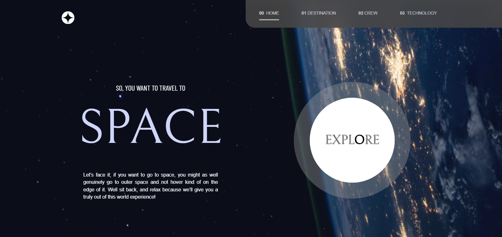
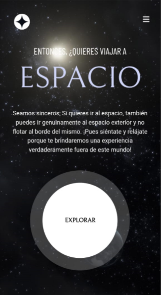
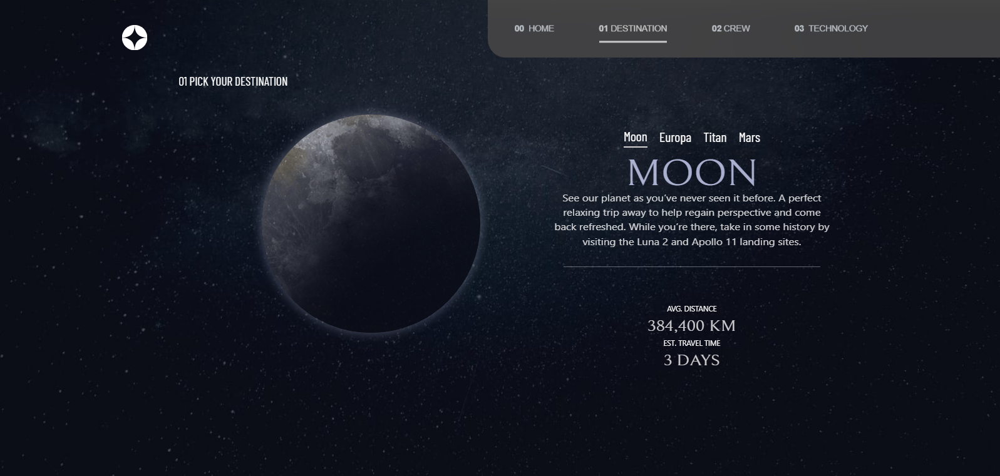
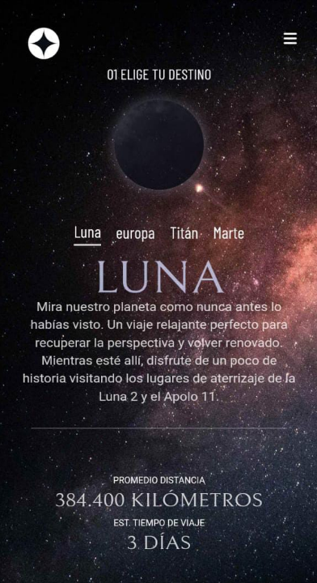
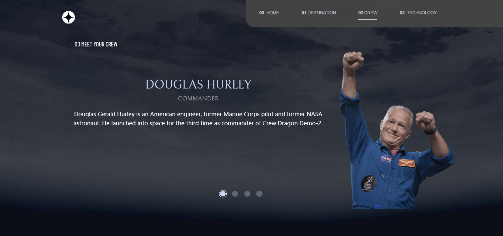
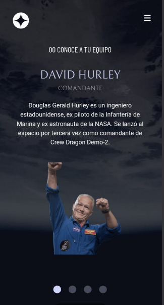
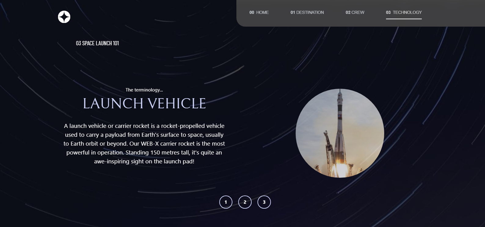
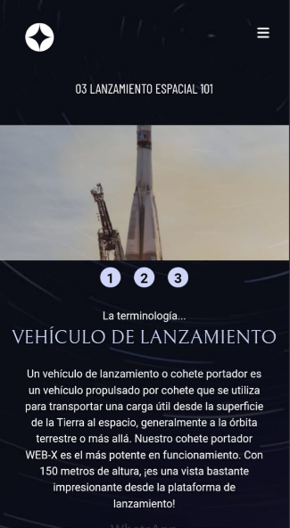

# Frontend Mentor - Space tourism website solution

This is a solution to the [Space tourism website challenge on Frontend Mentor](https://www.frontendmentor.io/challenges/space-tourism-multipage-website-gRWj1URZ3). Frontend Mentor challenges help you improve your coding skills by building realistic projects. 

### The challenge

Users should be able to:

- View the optimal layout for each of the website's pages depending on their device's screen size
- See hover states for all interactive elements on the page
- View each page and be able to toggle between the tabs to see new information

### Screenshot

### Links

- Solution URL: [ solution : ](https://github.com/Breynersmith/space-tourism-vue)
- Live Site URL: [live :](https://breynersmith.github.io/space-tourism-vue/)

## My process

### Built with

- Semantic HTML5 markup
- CSS custom properties
- Flexbox
- CSS Grid
- Mobile-first workflow
- [vite + vue 3]()
- [Tailwind Css](https://tailwindcss.com/)
- [Styled Components](https://styled-components.com/) 

## Author

- Linkedin - [Breyner Ustariz](https://www.linkedin.com/in/breynerustariz/)
- Frontend Mentor - [@Breynersmith](https://www.frontendmentor.io/profile/Breynersmith)
- Facebook - [Breyner Ustariz](https://www.facebook.com/breyner.u/?locale=es_LA)

